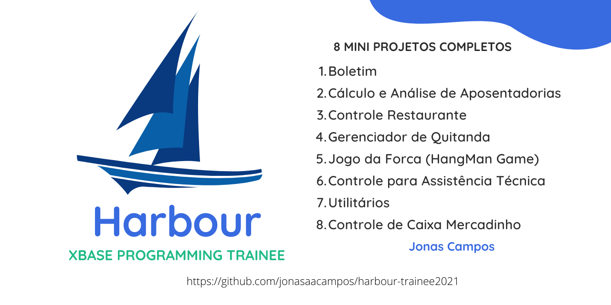
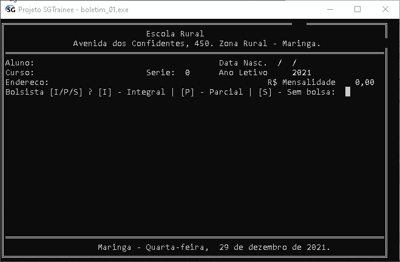
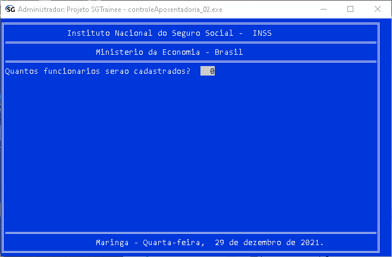
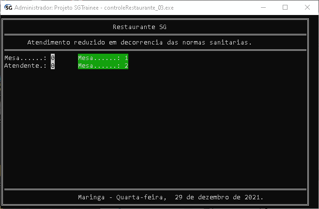
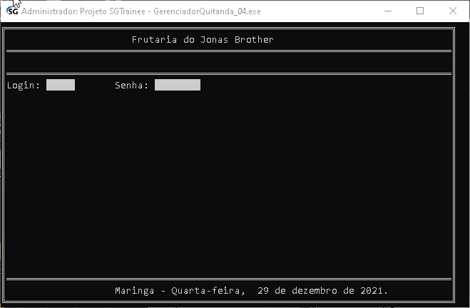
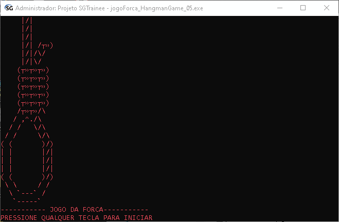
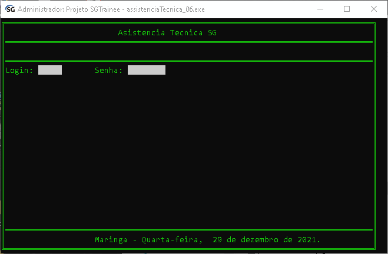
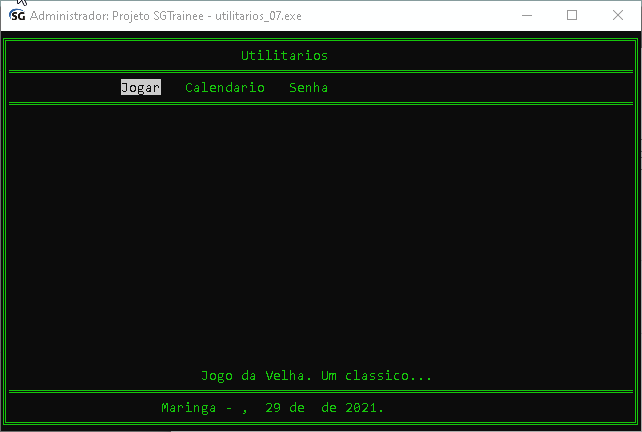
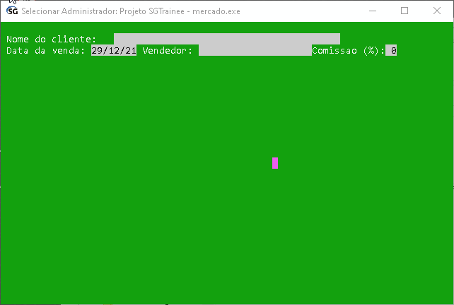

<!-- Read.me default para meus projetos -->

<!-- PROJECT SHIELDS |  -->
<p align='center'>
  <!-- Harbour xBAse -->
  

</p>

<!-- PROJECT LOGO -->
<br />
<p align="center">
  <a href="https://github.com/jonasaacampos/harbour-trainee2021">
    
  </a>

  <h3 align="center">08 Mini Projetos</h3>

  <p align="center"> 
  Alguns mini projetos com código fonte e executáveis, que podem ser compilados e adaptados para quaisquer finalidades.
  </p>

  

  ---

<!-- ABOUT THE PROJECT -->

**1. Boletim**
  

  Source code: [Boletim](src/boletim_01.prg)

  Executável: [Boletim.exe](exe/boletim_01.exe)

  ---
**2. Calculo e Análise de Aposentadorias**


Source code: [Calculo e Análise de Aposentadorias](src/controleAposentadoria_02.prg)

Executável: [ControleAposentadoria.exe](exe/controleAposentadoria_02.exe)

  ---

**3. Controle Restaurante**

Source code: [Controle Restaurante](src/controleRestaurante_03.prg)

Executável: [ControleRestaurante.exe](exe/controleRestaurante_03.exe)

---

**4. Gerenciador de Quitanda**

Source code: [Gerenciador de Quitanda](src/GerenciadorQuitanda_04.prg)

Executável: [GerenciadorQuitanda.exe](exe/GerenciadorQuitanda_04.exe)

---

**5. Jogo da Gorca (HangMan Game)**

Source code: [Jogo da Gorca (HangMan Game)](src/jogoForca_HangmanGame_05.prg)

Executável: [JogoForca.exe](exe/jogoForca_HangmanGame_05.exe)

---
    
**6. Controle para Assistência Técnica**

Source code: [Controle para Assistência Técnica](src/assistenciaTecnica_06.prg)

Executável: [AssistenciaTecnica.exe](exe/assistenciaTecnica_06.exe)

---

**7. Utilitários**

Source code: [Utilitários](src/utilitarios_07.prg)

---

**8. Controle de Caixa Mercadinho**

Source code: [Controle de Caixa Mercadinho](src/mercado.prg)

---

## O que esperar deste repositório

São códigos limpos e funcionais que mostram a sintaxe básica da linguagem harbor/clipper no que tange:

- ✔️ Operações de cálculo
- ✔️ Trabalho com datas
- ✔️ Trabalho com menus

Este projeto _não faz:_

- ❌ não existem funções, o código é longo mesmo
- ❌ os dados são armazenados somente em memória
- ❌ as funcionalidades não foram 100% testadas
- ❌ os códigos não estão (se é que um dia estarão) perfeitos

<!-- GETTING STARTED -->
## Contribua e/ou copie o projeto

Siga estes simples passos para 

### Instalação

1. Faça um clone do repositório
   ```sh
   git clone https://github.com/jonasaacampos/harbour-trainee2021.git
   ```
2. Instale as dependências necessárias
   
  **Compilador Harbour**
   ```sh
   https://sourceforge.net/projects/harbour-project/files/
   ```
   Para compilar utilize o comando.
   ```
    hbmk2 FileName.prg
   ```
   Para executar abra o *.exe no prompt do windows ou no linux execute com
   ```
    ./fileName
   ```
<!-- Exemplos -->
## Ao infinito (e além)

**Casos de Uso**

A ideia repositório é compartilhar informações sobre lógica de programação, além de mostrar um pouco de uma linguagem que poucas empresas ainda utilizam, mas que ainda existem programas que rodam com esta linguagem.

<!-- LICENSE -->
## Licença de utilização

<a rel="license" href="http://creativecommons.org/licenses/by/4.0/">
  
</a>
<br/>
This work is licensed under a <a rel="license" href="http://creativecommons.org/licenses/by/4.0/">Creative Commons Attribution 4.0 International License</a>.

<!-- CONTACT -->
## Contato

<p align='center'>

  <a href='https://github.com/jonasaacampos'>
    
  </a>

  <a href='https://www.linkedin.com/in/jonasaacampos/'>
    
  </a>

  <a href='https://www.facebook.com/jonasaacampos'>
    
  </a>

</p>

**Author:** Jonas Araujo de Avila Campos

**Confira mais projetos: [AQUI](https://jonasaacampos.github.io/portifolio/)**

[](https://github.com/jonasaacampos)

<!-- Referências -->
## Referências e créditos das imagens


### Créditos das imagens
- Badges por [Alexandre Sanlim]('https://github.com/alexandresanlim')

## Talvez você goste (mais conteúdo)

<a href="https://github.com/anuraghazra/github-readme-stats">
  
</a>
